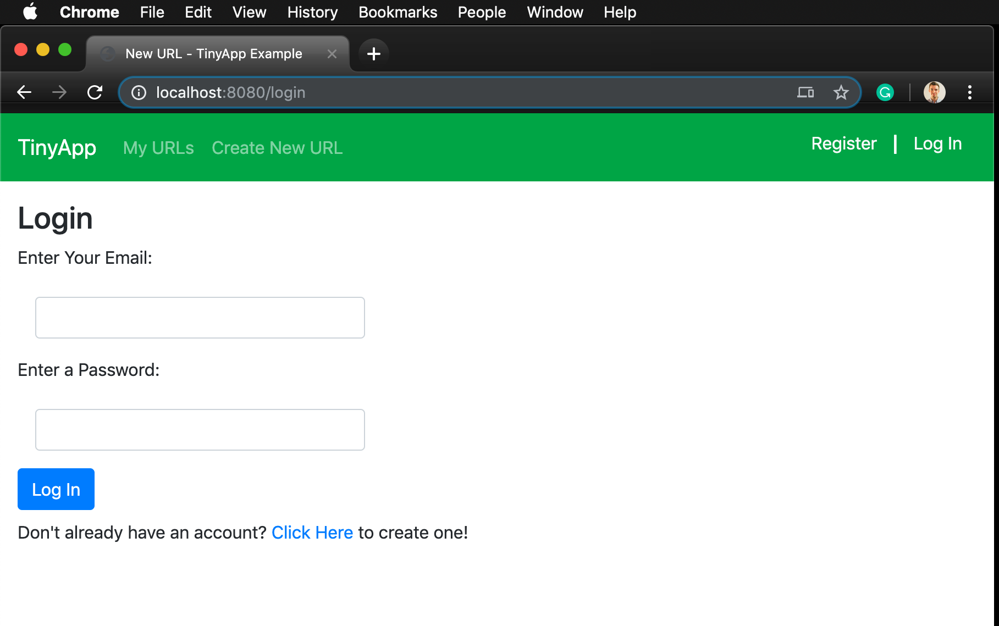
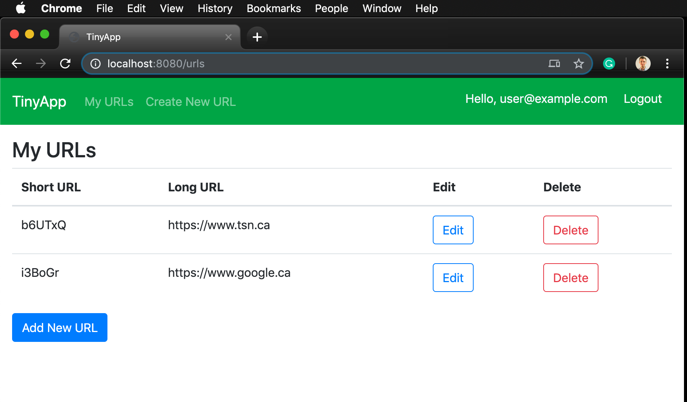
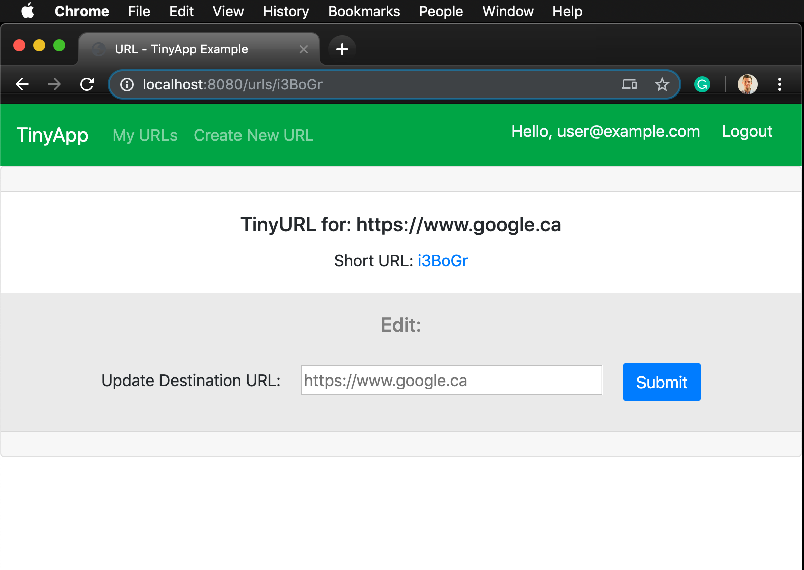

# TinyApp Project

October 2019

TinyApp is a full stack web application built with Node and Express that allows users to shorten long URLs (à la bit.ly).

## Final Product

TinyApp requires users to log in to create new short urls and to edit them. Once a shortened url has been created it can be followed to the original site that is linked.

Login Page Prompts users to log in to see their urls:

Main urls page shows logged in user the urls that they have input and the short urls assigned to them:

The details page is where you can edit and update a url that has been shortend using TinyApp.
)

## Dependencies

- Node.js
- Express
- EJS
- bcrypt
- body-parser
- cookie-session

## Getting Started

- Install all dependencies (using the `npm install` command).
- Run the development web server using the `node express_server.js` command.
- Navigate in your browser to [localhost:8080/](localhost:8080/) to use TinyApp.
- Type in localhost:8080/u/\<short URL address> to use shortend address.